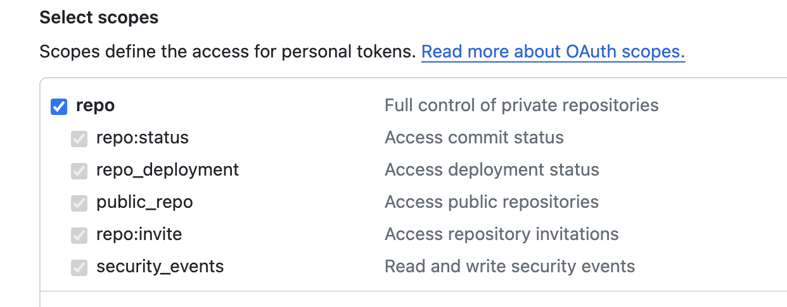
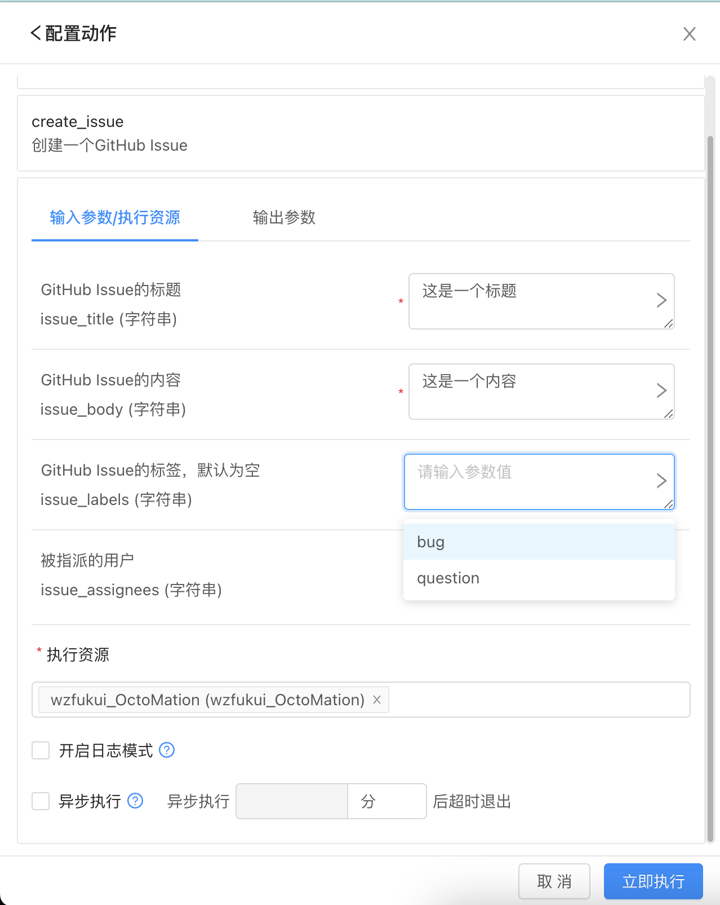
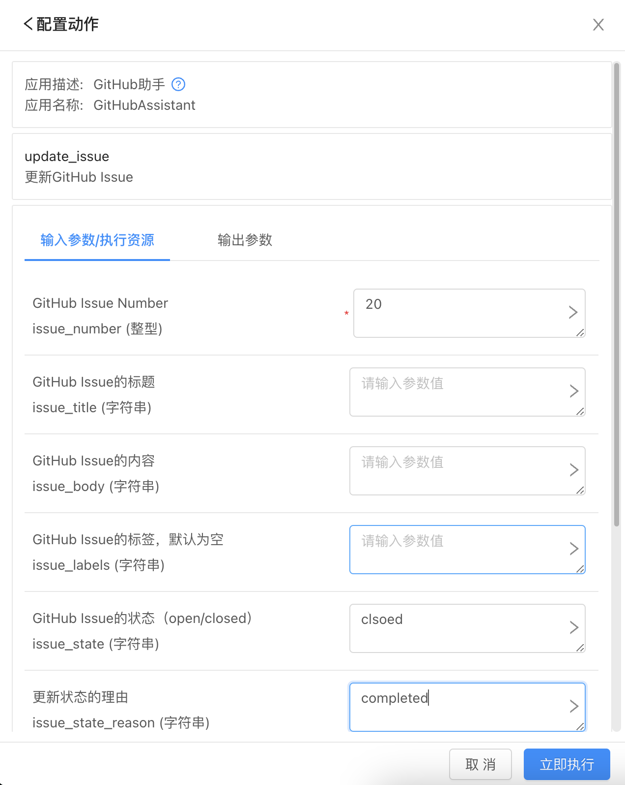
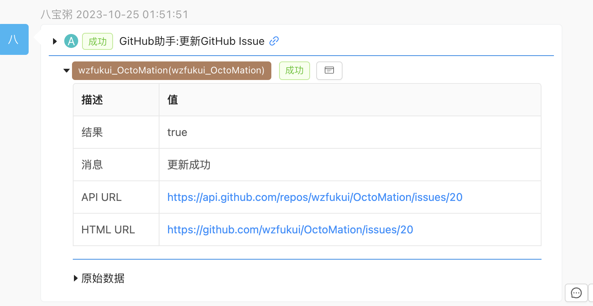

# GitHub项目助手

## 基本信息

- 版本： Ver 1.0.0
- 作者：[wzfukui](https://github.com/wzfukui)
- 更新时间：Oct-24,2023

## 配置要求

- 使用您的项目拥有者账号，访问[https://github.com/settings/tokens/new](https://github.com/settings/tokens/new)，创建一个GithHub Personal Access Token（classic）
- 务必勾选`Repo`权限
- 未来可能扩展Discussion的接口，需要同步勾选`write:discussion`。



## 特别说明

### issue的状态

只有两种状态

- `open`
- `closed`

### 修改issue状态的reason

只有四种选项

- `completed`
- `not_planned`
- `reopened`
- `null`

### 遗留问题

- assignees目前只支持指派个一个人，不支持多人
- labels目前支持一个标签，不支持多个

## 基本功能

### 创建GitHub Issue:create_issue

输入参数：
```json
{
    "issue_title": "Test Title",
    "issue_body": "Test Body",
    "issue_label": "bug"
}
```

返回结果：
```json
{
  "code": 200,
  "msg": "创建成功",
  "data": {
    "success": true,
    "issue_number": 19,
    "issue_api_url": "https://api.github.com/repos/owner/repo/issues/19",
    "issue_html_url": "https://github.com/owner/repo/issues/19"
  }
}
```

### 更新GitHub Issue:update_issue_state

输入参数1：

```json
{
  "issue_number":1,
  "issue_state": "closed",
  "issue_state_reason": "Close it"
}
```
输入参数2：

```json
{
  "issue_number":2,
  "issue_title": "New issue name",
  "issue_body": "new issue body"
}
```

返回结果：

```json
{
  "code": 200,
  "msg": "更新成功",
  "data": {
    "success": true,
    "issue_api_url": "https://api.github.com/repos/owner/repo/issues/19",
    "issue_html_url": "https://github.com/owner/repo/issues/19"
  }
}
```

### 测试接口健康性

输入参数：**无**

返回结果：

```json
{
  "code": 200,
  "msg": "测试成功",
  "data": {
    "success": true
  }
}
```
# 使用截图
## 创建issue



## 更新issue





# 参考资料
- [Use the REST API to manage issues and pull requests.](https://docs.github.com/en/rest/issues/issues?apiVersion=2022-11-28)

